# PINEDESK — HỆ THỐNG HỖ TRỢ KỸ THUẬT

[](https://github.com/Lacia1803/pinedesk/actions/workflows/ci.yml)

> **Đồ án thực tập** — Trường Đại học Đà Lạt (DLU)
> Hệ thống quản lý phòng máy, thiết bị CNTT và tiếp nhận sự cố dạng ticket,
> xây dựng trên nền tảng mã nguồn mở **GLPI 11**.
>
> Tên **PineDesk** ghép từ *pine* (rừng thông Đà Lạt) và *desk* (bàn hỗ trợ).

## Giao diện

### Trang đăng nhập

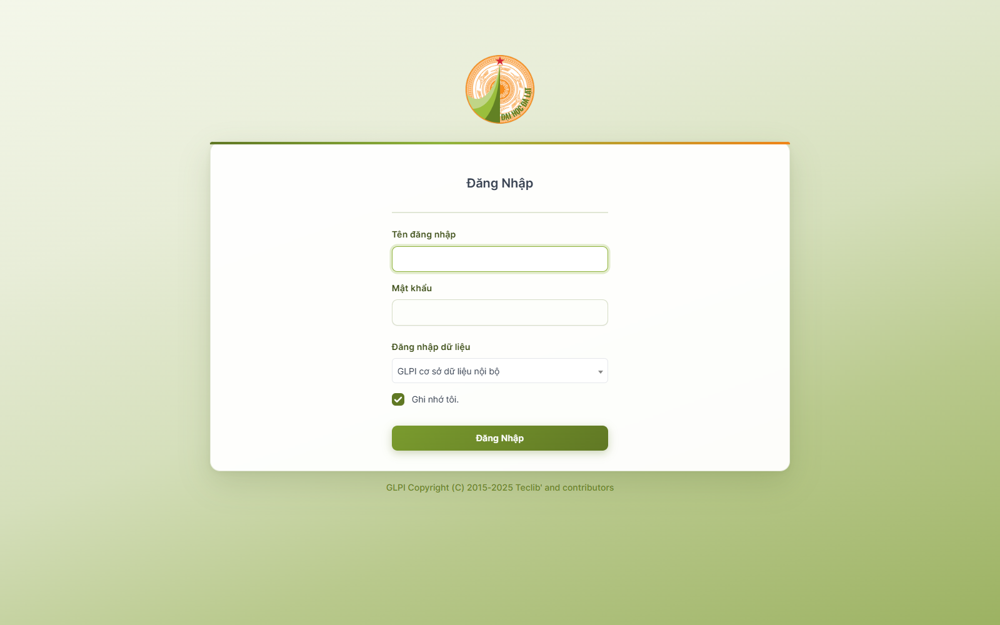

### Bảng điều khiển

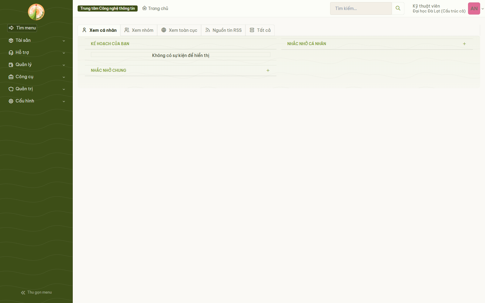

### Quản lý tài sản

| Danh sách máy tính | Chi tiết thiết bị |
|---|---|
| 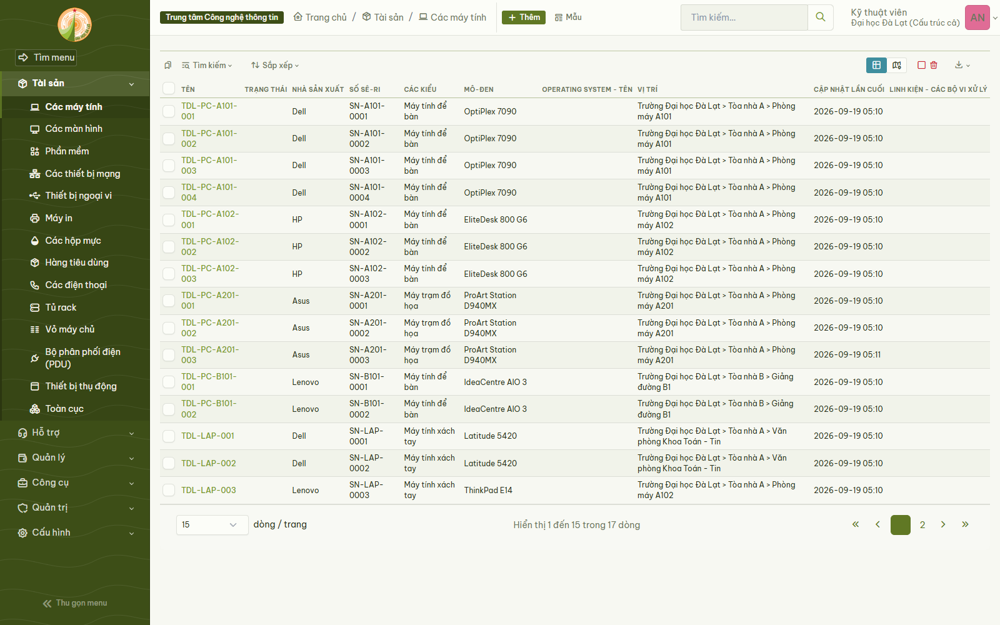 | 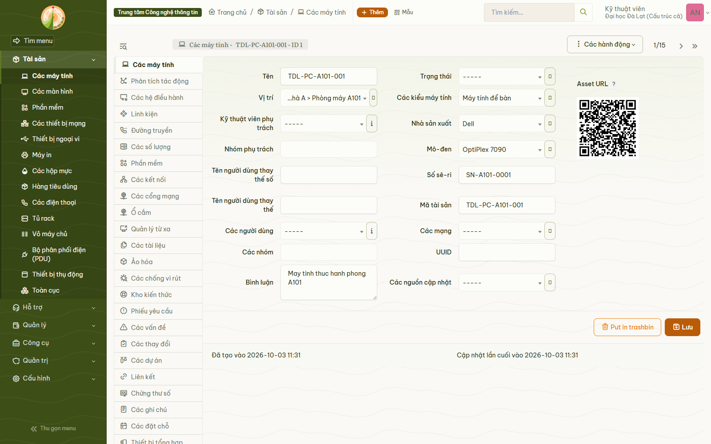 |

| Màn hình | Thiết bị mạng |
|---|---|
| 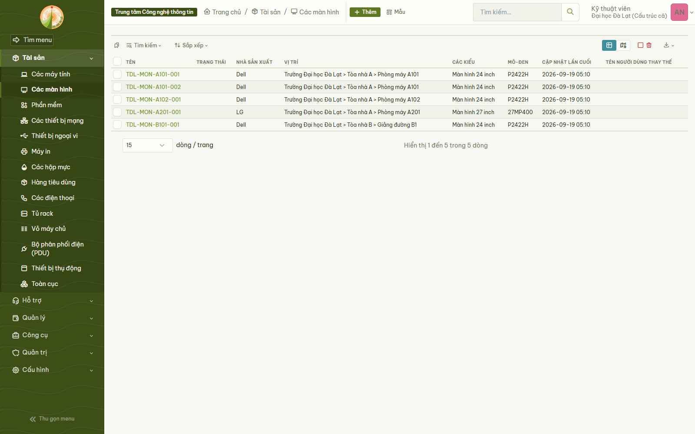 | 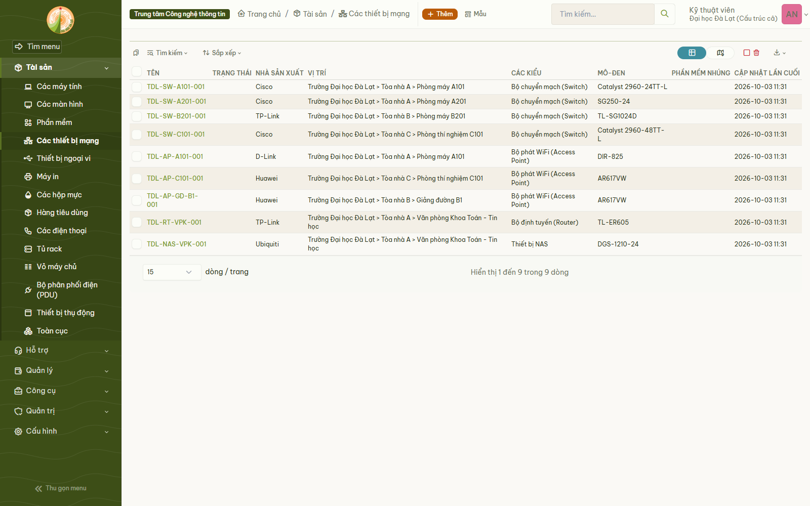 |

| Máy in | Phần mềm |
|---|---|
| 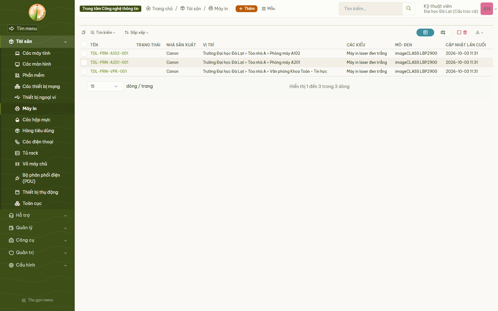 | 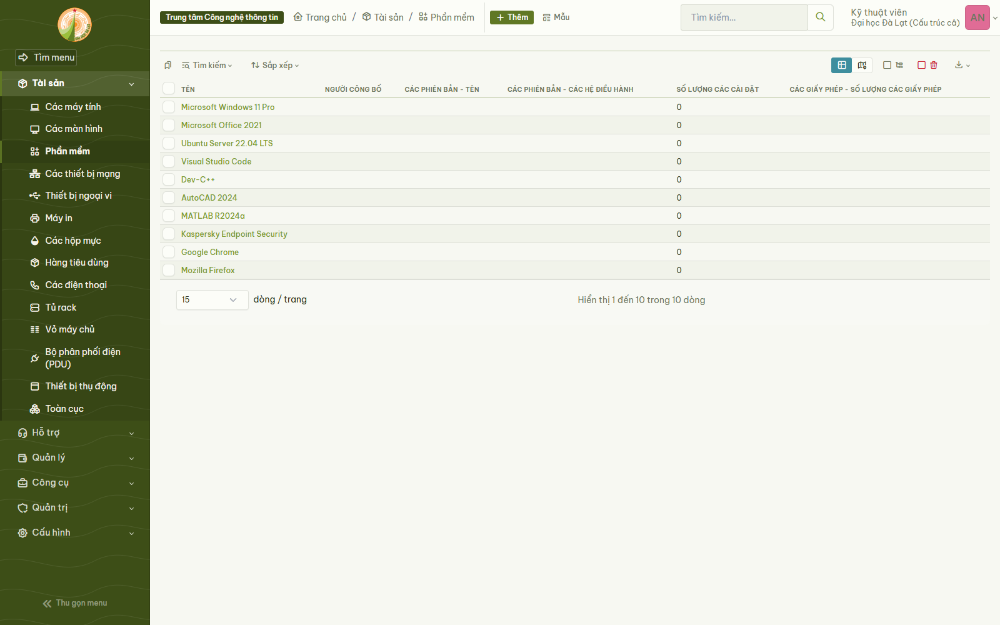 |

| Thêm thiết bị mới | Hành động hàng loạt |
|---|---|
| 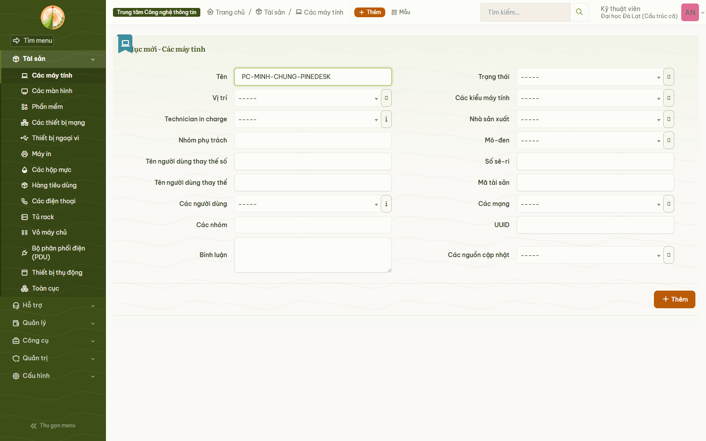 | 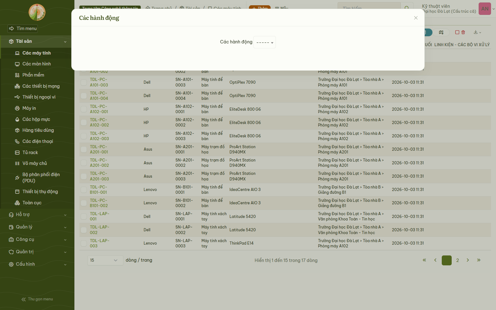 |

### Tiếp nhận sự cố

| Danh sách phiếu yêu cầu | Tạo phiếu mới |
|---|---|
| 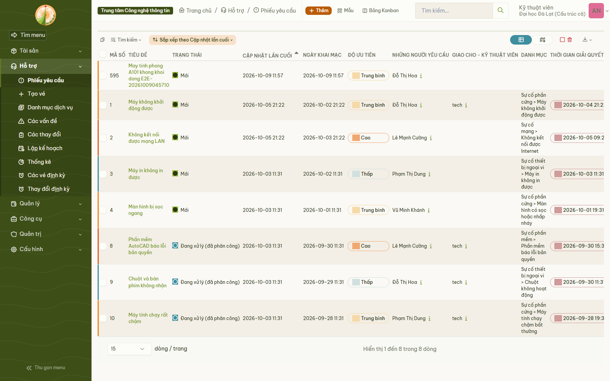 | 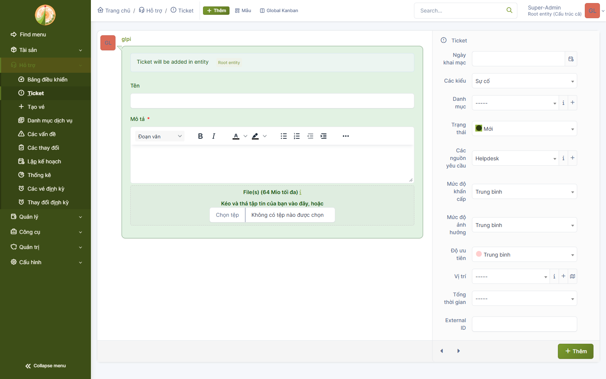 |

### Mã QR cho thiết bị

Mã QR in trên hồ sơ thiết bị, quét ra là mở đúng máy đó:

| Mã QR trên hồ sơ thiết bị | Nhãn QR in hàng loạt |
|---|---|
| 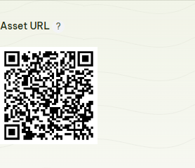 | 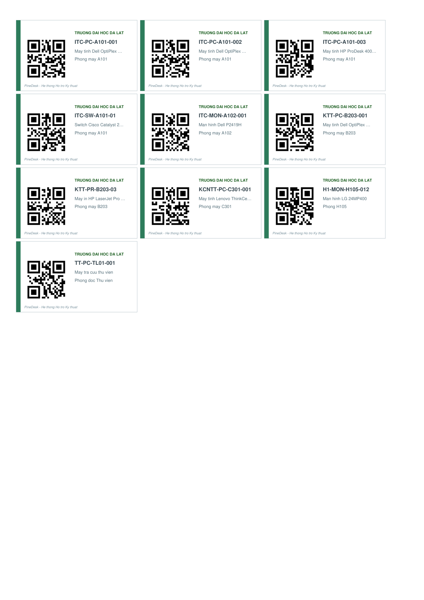 |

### Nhân sự và tổ chức

| Cơ cấu tổ chức | Người dùng |
|---|---|
| 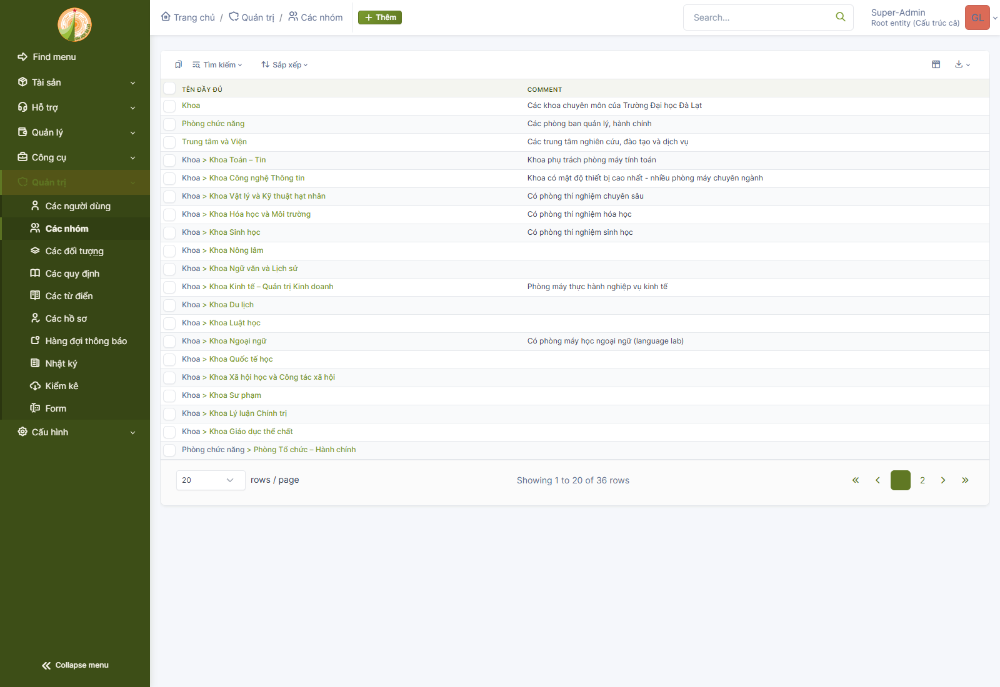 | 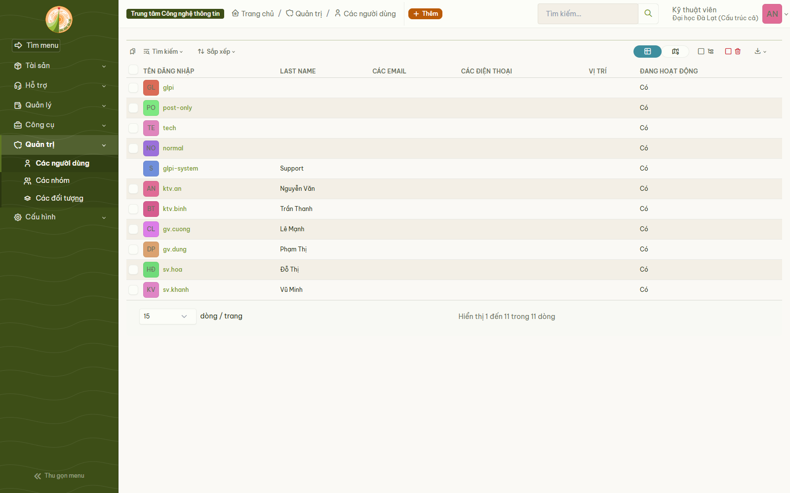 |

### Thống kê

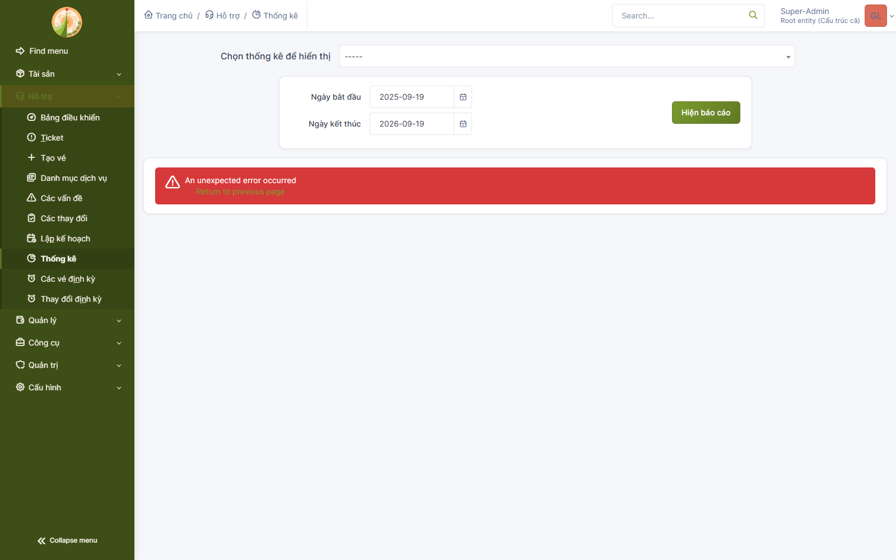

Ảnh minh chứng đầy đủ nằm trong [`tai-lieu/anh-giao-dien/`](tai-lieu/anh-giao-dien/).

## Tính năng chính

| Nhóm chức năng | Chi tiết |
|---|---|
| **Quản lý tài sản** | Phòng máy, máy tính, thiết bị mạng, phần mềm; hồ sơ đầy đủ kèm **mã QR** |
| **Tiếp nhận sự cố** | Ticket theo chuẩn ITIL: máy hỏng, lỗi mạng, lỗi phần mềm, thiết bị ngoại vi |
| **Phân công xử lý** | Giao việc cho kỹ thuật viên, theo dõi tiến độ, **5 mức SLA cấu hình sẵn** (xem ghi chú bên dưới) |
| **Chống lạm dụng** | 6 tầng: rate limit · bắt buộc đăng nhập · hạn mức phiếu · chống trùng · kiểm duyệt · nhật ký |
| **Bảo trì định kỳ** | Lịch sử sửa chữa theo từng thiết bị; lịch bảo trì tạo qua giao diện GLPI |
| **Dashboard** | Thống kê số thiết bị, sự cố, lịch bảo trì theo thời gian thực |
| **Giao diện Đà Lạt** | Bảng màu xanh rêu + cam đất trích từ logo DLU, áp dụng toàn hệ thống |
| **Việt hoá** | Mặc định tiếng Việt, 556 thuật ngữ dịch bổ sung + 212 mục dạng số nhiều (32,0% catalog; menu, biểu mẫu & nhãn dashboard 100%) |
| **Bảo mật** | HTTPS (chứng chỉ tự ký **có SAN**), chống brute-force, phân quyền theo vai trò, sao lưu tự động |

> ⚠️ **Về SLA — nói rõ để tránh hiểu nhầm:** hệ thống đã cấu hình **5 mức SLA thật
> trong CSDL** (`glpi_slas`), nhưng các con số (8h/4h/2h/1h/30p) là **đề xuất kỹ
> thuật của đồ án**, **chưa phải cam kết đã được Trường Đại học Đà Lạt ban hành**.
> Chi tiết: [`tai-lieu/README.md`](tai-lieu/README.md) mục 4.5.

## Bắt đầu nhanh

```bash
# Di chuyển vào thư mục gốc của dự án (thay bằng đường dẫn thực trên máy bạn)
cd duong-dan-toi/pinedesk
cp .env.example .env     # rồi mở .env và đổi TẤT CẢ mật khẩu mẫu
bash scripts/cai-dat-tat-ca.sh
```

Script kiểm tra `.env` trước khi khởi động: thiếu file, hoặc mật khẩu còn
nguyên chuỗi mẫu `<DOI_MAT_KHAU_MANH_TAI_DAY>`, đều bị từ chối kèm hướng dẫn.

Script tự động làm 6 việc và báo kết quả từng bước:

1. Khởi động 4 container (GLPI · MariaDB · Redis · Nginx)
2. Nạp **danh mục nghiệp vụ**: 12 toà nhà · 54 phòng · 16 khoa · 10 phòng ·
   7 trung tâm · 10 trạng thái · 79 loại sự cố …
3. Bật **plugin QR** + **plugin giao diện Đà Lạt** + **plugin chặn hạn mức phiếu**
4. Nạp **bản dịch tiếng Việt** (gộp bản chính thức + bổ sung của đồ án)
5. Nạp **SLA thật + cơ chế chống lạm dụng** (hạn mức phiếu, chống trùng, nhật ký)
6. Kiểm tra sức khỏe hệ thống (5 hạng mục)

Truy cập: **https://localhost:8443** · Tài khoản: `glpi`
⚠️ **Đổi mật khẩu `glpi` ngay sau khi đăng nhập lần đầu.**
Mật khẩu admin **không lưu trong mã nguồn**; các script tự động hoá đọc mật khẩu
từ biến môi trường `GLPI_PASS` (không truyền qua tham số dòng lệnh).

## Kiến trúc

```
Người dùng --HTTPS:8443--> [ Nginx Gateway ]
                                    |
                          HTTP:80   |
                                    v
                            [ GLPI 11 ] <--> [ Redis Cache ]
                                    |
                                    v
                              [ MariaDB 10.11 ]
```

Mỗi thành phần chạy trong container riêng, cô lập và dễ bảo trì.
Database và Redis chỉ giao tiếp trong mạng nội bộ Docker, không lộ ra ngoài.

## Cấu trúc thư mục

```
pinedesk/
├── .github/workflows/ci.yml     # ★ Pipeline kiểm tra tự động (6 nhóm)
├── docker-compose.yml           # Định nghĩa 4 dịch vụ Docker
├── .env                         # Biến môi trường (chứa mật khẩu)
├── start.sh                     # Khởi động hệ thống
├── Makefile                     # Lệnh thường dùng: make kiem-tra / smoke / up...
├── package.json                 # Khai báo playwright-core (cho script chụp ảnh/kiểm thử)
├── package-lock.json            # Ghim phiên bản (npm ci tái lập được)
├── requirements.txt             # Thư viện Python cho script sinh mã QR
├── config/                      # Cấu hình PHP (QR, bảo mật)
├── nginx/                       # Gateway: HTTPS, rate limit, bảo mật
│   └── ssl/openssl-san.cnf      #   Cấu hình sinh chứng chỉ SSL (có SAN)
├── themes/                      # Đăng ký bảng màu Đà Lạt (chỉ có tên file, KHÔNG chứa màu)
├── plugins/dlubrand/            # Plugin giao diện Đà Lạt (CSS + logo) — NGUỒN MÀU DUY NHẤT
├── plugins/pinedesk/            # ★ Plugin chặn hạn mức phiếu (T3/T4/T6) — hook ngoài lõi
│   ├── hook.php                 #   Kiểm tra hạn mức + chống trùng + nhật ký
│   └── tests/kiem-thu-han-muc.php #  Harness kiểm thử trên CSDL thật (37 điểm kiểm)
├── scripts/                     # ★ Tất cả script tự động hoá
│   ├── cai-dat-tat-ca.sh        #   Cài toàn bộ, 1 lệnh
│   ├── nap-du-lieu-nen.sh       #   Nạp danh mục nghiệp vụ
│   ├── nap-du-lieu-mau.sh       #   ★ Nạp dữ liệu demo (thiết bị, phiếu, tài khoản)
│   ├── seed-du-lieu-mau.sql     #     Dữ liệu mẫu
│   ├── viet-hoa-du-lieu.sh      #   Việt hoá DỮ LIỆU (tên đơn vị, hồ sơ quyền)
│   ├── nap-sla-va-chong-lam-dung.sh # ★ Nạp SLA thật + hạn mức chống spam
│   ├── seed-sla-va-chong-lam-dung.sql #  SLA + bảng nhật ký/hạn mức
│   ├── kiem-tra-lam-dung.sh     # ★ Phát hiện spam / trùng phiếu theo tài khoản
│   ├── kiem-tra-chuc-nang.sh    # ★ Kiểm thử chức năng theo vai trò (KTV/sinh viên)
│   ├── quet-bi-mat.sh           #   Quét bí mật hardcode (CI chạy)
│   ├── tao-mo-bo-sung.py        #   Tạo lớp phủ bản dịch
│   ├── gop-ban-dich-tieng-viet.py  # Gộp bản dịch (không mất chuỗi + và số nhiều)
│   ├── do-do-phu-tieng-viet.py  #   Đo tỉ lệ Việt hoá
│   ├── bo-sung-tieng-viet.py    #   Từ điển thuật ngữ (đơn + số nhiều)
│   ├── chup-lai-anh-minh-chung.js  # Chụp tối đa 16 ảnh minh chứng (một màn hình một ảnh)
│   ├── chup-anh-qr-admin.js     #   Chụp luồng in QR (cần tài khoản quản trị)
│   ├── kiem-tra-usecase.js      #   3 use case thật end-to-end (Playwright)
│   ├── kiem-tra-massive-qr.js   #   Kiểm tra sinh QR hàng loạt qua modal
│   ├── kiem-tra-qr-va-chup-anh.js #  Kiểm tra plugin Barcode + chụp minh chứng
│   ├── chup-anh-giao-dien.js    #   Chụp nhanh 3 ảnh giao diện cơ bản
│   ├── lib/browser.js           #   Helper Playwright dùng chung (tìm Chrome, đăng nhập)
│   └── sinh-ma-qr.py            #   Sinh mã QR hàng loạt
├── backup/                      # Script sao lưu dữ liệu
└── tai-lieu/                    # ★ Tài liệu hướng dẫn + ảnh minh chứng
    ├── README.md                # ★ Tài liệu tổng hợp toàn diện (nghiệp vụ, kiến trúc, 6 tầng phòng thủ, cài đặt, demo, phản biện)
    ├── slide-bao-ve.html        # ★ 7 slide bảo vệ, chạy ngoại tuyến
    └── anh-giao-dien/           # Ảnh chụp giao diện thực tế
```

## Dữ liệu demo

Hệ thống cài xong là **CSDL rỗng**, không thể demo. Chạy 1 lệnh để có dữ liệu:

```bash
bash scripts/nap-du-lieu-mau.sh
```

Kết quả: **17 máy tính · 5 màn hình · 3 máy in · 9 thiết bị mạng · 10 phần mềm ·
13 phiếu sự cố (đủ 4 trạng thái) · 6 tài khoản 3 vai trò**.

| Tài khoản | Mật khẩu | Vai trò |
|---|---|---|
| `tech` | `tech` | Kỹ thuật viên (tài khoản có sẵn của GLPI) |
| `ktv.an`, `ktv.binh` | `Dlu@2026` | Kỹ thuật viên |
| `gv.cuong`, `gv.dung` | `Dlu@2026` | Giảng viên |
| `sv.hoa`, `sv.khanh` | `Dlu@2026` | Sinh viên |

> Tài khoản `tech` do chính trình cài đặt GLPI tạo ra, không thuộc script
> `nap-du-lieu-mau.sh`, nên mật khẩu là `tech` chứ không phải `Dlu@2026`.

> Script **idempotent** — chạy lại nhiều lần không nhân đôi dữ liệu.
> Mã tài sản theo quy ước thật: `TDL-PC-A101-001` = ĐH Đà Lạt – Máy tính – Toà A – Phòng 101 – Máy 01.

## Lệnh thường dùng

```bash
# Cài đặt & dữ liệu
bash scripts/cai-dat-tat-ca.sh       # Cài toàn bộ hệ thống (1 lệnh)
bash scripts/nap-du-lieu-nen.sh      # Chỉ nạp lại danh mục nghiệp vụ
bash scripts/nap-du-lieu-mau.sh      # Nạp dữ liệu demo (thiết bị, phiếu, tài khoản)
bash scripts/cai-giao-dien.sh        # Chỉ cài lại giao diện Đà Lạt

# Tiếng Việt
python scripts/tao-mo-bo-sung.py
python scripts/gop-ban-dich-tieng-viet.py
python scripts/do-do-phu-tieng-viet.py
bash   scripts/viet-hoa-du-lieu.sh   # Việt hoá dữ liệu (tên đơn vị, hồ sơ quyền)

# Mã QR
python scripts/sinh-ma-qr.py         # Sinh QR hàng loạt (dự phòng)

# Chụp ảnh giao diện (cần đăng nhập) — mật khẩu lấy từ biến môi trường:
#   GLPI_USER=ktv.an GLPI_PASS='<mat-khau>' node scripts/chup-lai-anh-minh-chung.js
node   scripts/chup-lai-anh-minh-chung.js # Chụp tối đa 16 ảnh minh chứng cho README
#   Một ảnh luồng in QR cần quyền quản trị: node scripts/chup-anh-qr-admin.js

# Vận hành
bash start.sh                        # Khởi động
docker compose logs -f glpi          # Xem log
docker compose stop                  # Dừng tạm thời
docker compose down                  # Tắt hoàn toàn
bash backup/backup.sh                # Sao lưu dữ liệu
```

## Tài liệu

| Tài liệu | Nội dung |
|---|---|
| [`tai-lieu/README.md`](tai-lieu/README.md) | **Tài liệu tổng hợp toàn diện**: bài toán nghiệp vụ, cơ cấu tổ chức DLU, kiến trúc so sánh GLPI gốc, phòng thủ 6 tầng chống lạm dụng, tùy biến giao diện & Việt hóa, tạo mã QR thiết bị, hướng dẫn triển khai & vận hành, kịch bản demo 7 phút và bộ 25 câu hỏi phản biện |
| [`slide-bao-ve.html`](tai-lieu/slide-bao-ve.html) | 7 slide bảo vệ, tự chứa, chạy được khi không có mạng |
| [`BAO-CAO-THUC-TAP.md`](tai-lieu/BAO-CAO-THUC-TAP.md) | Báo cáo thực tập tốt nghiệp đầy đủ (bản in) |

## Kiểm thử tự động (CI)

Mỗi pull request và mỗi lần push lên `main`/`master` đều chạy pipeline
[`.github/workflows/ci.yml`](.github/workflows/ci.yml) — **6 nhóm kiểm tra**:

| # | Nhóm | Nội dung |
|---|---|---|
| 1 | **Cú pháp** | `bash -n` (shell) · `py_compile` (Python) · `node --check` (JS) |
| 2 | **ShellCheck** | Lint shell ở mức `warning` — bắt lỗi thật, không bắt style |
| 3 | **Cấu hình** | `docker compose config` · mọi service phải có `healthcheck` · `nginx -t` |
| 4 | **Chứng chỉ SSL** | Sinh được từ `openssl-san.cnf` và **bắt buộc có SAN** |
| 5 | **Bảo mật** | Không commit `.env`/chứng chỉ; không hardcode mật khẩu hay đường dẫn máy cá nhân |
| 6 | **Smoke test** | Khởi động thật 4 container → chờ `healthy` → kiểm tra HTTP/HTTPS, plugin, dữ liệu khớp tài liệu, chống lạm dụng, phân quyền, **3 use case end-to-end bằng Playwright (Chrome thật)** |

> Pipeline **chặn merge** nếu bất kỳ cửa nào thất bại. Chạy kiểm tra nhanh trên
> máy trước khi push bằng **một lệnh** (gom đúng các bước CI, trừ smoke test):
>
> ```bash
> make kiem-tra        # cú pháp shell/Python/JS + ShellCheck + quét bí mật + compose/nginx
> make cu-phap-php     # cú pháp PHP của plugin (cần Docker)
> make smoke           # khởi động thật 4 container (~5 phút)
> ```
>
> Xem tất cả lệnh: `make giup`. Không có `make` thì chạy thủ công:
>
> ```bash
> bash -n start.sh                     # cú pháp shell
> python -m py_compile scripts/*.py    # cú pháp Python
> node --check scripts/lib/browser.js  # cú pháp JS
> docker compose config --quiet        # cấu hình compose
> ```

## Yêu cầu hệ thống

- Docker Desktop 20.10 trở lên
- RAM tối thiểu 4 GB (khuyến nghị 8 GB)
- Dung lượng đĩa trống 10 GB
- OpenSSL 3.x (có sẵn trong Git Bash)
- Node.js 18 trở lên + `npm ci` (cho script chụp ảnh/kiểm thử Playwright,
  chạy trên máy có Chrome cài sẵn). `npm ci` dùng `package-lock.json` để cài
  đúng phiên bản `playwright-core` đã ghim → tái lập được trên mọi máy.
- Python 3.9 trở lên + `pip install -r requirements.txt` (chỉ cần khi chạy
  `scripts/sinh-ma-qr.py`; các script Việt hoá khác chỉ dùng thư viện chuẩn)

## Giấy phép

Hệ thống sử dụng GLPI — phần mềm mã nguồn mở theo giấy phép **GPL v3**.
