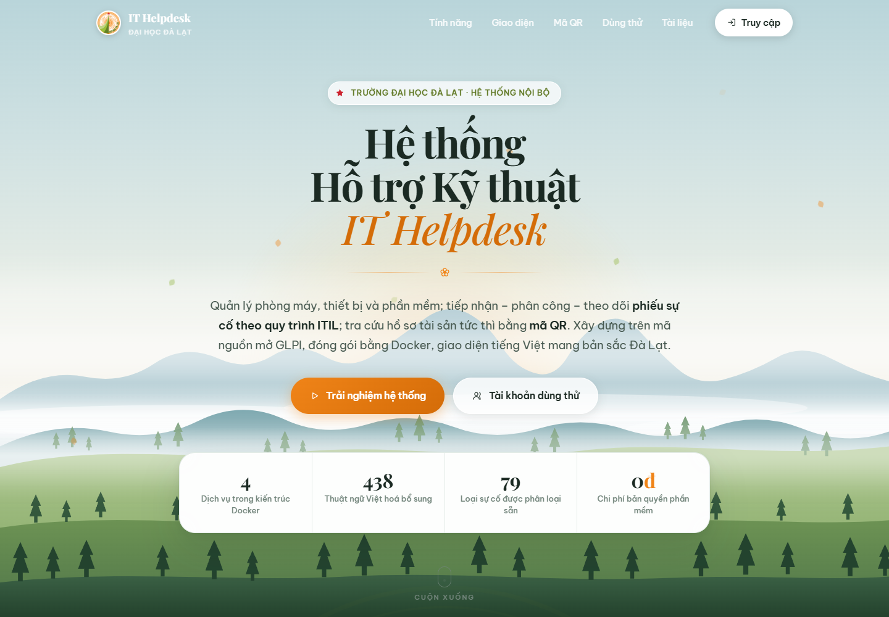
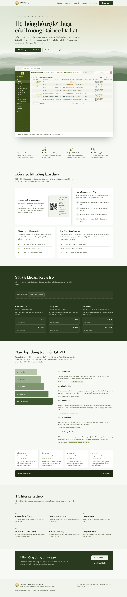

# PINEDESK — HỆ THỐNG HỖ TRỢ KỸ THUẬT

[](https://github.com/Lacia1803/pinedesk/actions/workflows/ci.yml)

> **Đồ án thực tập** — Trường Đại học Đà Lạt (DLU)
> Hệ thống quản lý phòng máy, thiết bị CNTT và tiếp nhận sự cố dạng ticket,
> xây dựng trên nền tảng mã nguồn mở **GLPI 11**.
>
> Tên **PineDesk** ghép từ *pine* (rừng thông Đà Lạt) và *desk* (bàn hỗ trợ).

## Giao diện

### Trang đăng nhập


### Bảng điều khiển


### Quản lý tài sản

| Danh sách máy tính | Chi tiết thiết bị |
|---|---|
|  |  |

| Màn hình | Thiết bị mạng |
|---|---|
|  |  |

| Máy in | Phần mềm |
|---|---|
|  |  |

| Thêm thiết bị mới | Hành động hàng loạt |
|---|---|
|  |  |

### Tiếp nhận sự cố

| Danh sách phiếu yêu cầu | Tạo phiếu mới |
|---|---|
|  |  |

### Mã QR cho thiết bị

Mã QR in trên hồ sơ thiết bị, quét ra là mở đúng máy đó:

| Mã QR trên hồ sơ thiết bị | Nhãn QR in hàng loạt |
|---|---|
|  |  |

### Nhân sự và tổ chức

| Cơ cấu tổ chức | Người dùng |
|---|---|
|  |  |

### Thống kê


### Trang giới thiệu dự án



[](tai-lieu/anh-giao-dien/17-landing-toan-trang.png)

Ảnh minh chứng đầy đủ nằm trong [`tai-lieu/anh-giao-dien/`](tai-lieu/anh-giao-dien/).

## Tính năng chính

| Nhóm chức năng | Chi tiết |
|---|---|
| **Quản lý tài sản** | Phòng máy, máy tính, thiết bị mạng, phần mềm; hồ sơ đầy đủ kèm **mã QR** |
| **Tiếp nhận sự cố** | Ticket theo chuẩn ITIL: máy hỏng, lỗi mạng, lỗi phần mềm, thiết bị ngoại vi |
| **Phân công xử lý** | Giao việc cho kỹ thuật viên, theo dõi tiến độ, **5 mức SLA cấu hình sẵn** (xem ghi chú bên dưới) |
| **Chống lạm dụng** | 6 tầng: rate limit · bắt buộc đăng nhập · hạn mức phiếu · chống trùng · kiểm duyệt · nhật ký |
| **Bảo trì định kỳ** | Lịch sử sửa chữa theo từng thiết bị; lịch bảo trì tạo qua giao diện GLPI |
| **Dashboard** | Thống kê số thiết bị, sự cố, lịch bảo trì theo thời gian thực |
| **Giao diện Đà Lạt** | Bảng màu xanh rêu + cam đất trích từ logo DLU, áp dụng toàn hệ thống |
| **Việt hoá** | Mặc định tiếng Việt, 443 thuật ngữ dịch bổ sung + 212 mục dạng số nhiều (30,6% catalog; menu, biểu mẫu & nhãn dashboard 100%) |
| **Trang giới thiệu** | Landing page thiết kế riêng tại `/landing/` — lấy cảm hứng Đà Lạt & DLU, chạy được khi không có mạng |
| **Bảo mật** | HTTPS (chứng chỉ tự ký **có SAN**), chống brute-force, phân quyền theo vai trò, sao lưu tự động |

> ⚠️ **Về SLA — nói rõ để tránh hiểu nhầm:** hệ thống đã cấu hình **5 mức SLA thật
> trong CSDL** (`glpi_slas`), nhưng các con số (8h/4h/2h/1h/30p) là **đề xuất kỹ
> thuật của đồ án**, **chưa phải cam kết đã được Trường Đại học Đà Lạt ban hành**.
> Chi tiết: [`tai-lieu/CHONG-LAM-DUNG.md`](tai-lieu/CHONG-LAM-DUNG.md) mục 6.

## Bắt đầu nhanh

```bash
# Di chuyen vao thu muc goc cua du an (thay bang duong dan thuc tren may ban)
cd duong-dan-toi/pinedesk
bash scripts/cai-dat-tat-ca.sh
```

Script tự động làm 6 việc và báo kết quả từng bước:

1. Khởi động 4 container (GLPI · MariaDB · Redis · Nginx)
2. Nạp **danh mục nghiệp vụ**: 12 toà nhà · 65 phòng máy · 16 khoa · 10 phòng ·
   7 trung tâm · 10 trạng thái · 79 loại sự cố …
3. Bật **plugin QR** + **plugin giao diện Đà Lạt**
4. Nạp **bản dịch tiếng Việt** (gộp bản chính thức + bổ sung của đồ án)
5. Nạp **SLA thật + cơ chế chống lạm dụng** (hạn mức phiếu, chống trùng, nhật ký)
6. Kiểm tra sức khỏe hệ thống (5 hạng mục)

Truy cập: **https://localhost:8443** · Tài khoản: `glpi`
⚠️ **Đổi mật khẩu `glpi` ngay sau khi đăng nhập lần đầu.**
Mật khẩu admin **không lưu trong mã nguồn**; các script tự động hoá đọc mật khẩu
từ biến môi trường `GLPI_PASS` (không truyền qua tham số dòng lệnh).

## Kiến trúc

```
Nguoi dung --HTTPS:8443--> [ Nginx Gateway ]
                                    |
                          HTTP:80   |
                                    v
                            [ GLPI 11 ] <--> [ Redis Cache ]
                                    |
                                    v
                              [ MariaDB 10.11 ]
```

Mỗi thành phần chạy trong container riêng, cô lập và dễ bảo trì.
Database và Redis chỉ giao tiếp trong mạng nội bộ Docker, không lộ ra ngoài.

## Cấu trúc thư mục

```
pinedesk/
├── .github/workflows/ci.yml     # ★ Pipeline kiem tra tu dong (6 nhom)
├── docker-compose.yml           # Dinh nghia 4 dich vu Docker
├── .env                         # Bien moi truong (chua mat khau)
├── start.sh                     # Khoi dong he thong
├── config/                      # Cau hinh PHP (QR, bao mat)
├── nginx/                       # Gateway: HTTPS, rate limit, bao mat
│   └── ssl/openssl-san.cnf      #   Cau hinh sinh chung chi SSL (co SAN)
├── themes/                      # Dang ky bang mau Da Lat (chi co ten file, KHONG chua mau)
├── plugins/dlubrand/            # Plugin giao dien Da Lat (CSS + logo) — NGUON MAU DUY NHAT
├── landing/                     # ★ Trang gioi thieu du an (nginx phuc vu tai /landing/)
│   ├── index.html               #   Noi dung trang
│   ├── assets/css/style.css     #   Thiet ke rieng (Da Lat + DLU)
│   ├── fonts/                   #   16 tep .woff2 tu luu — chay duoc khi khong co mang
│   └── dashboard-preview.png    #   Anh bang dieu khien (sinh tu du lieu that)
├── scripts/                     # ★ Tat ca script tu dong hoa
│   ├── cai-dat-tat-ca.sh        #   Cai toan bo, 1 lenh
│   ├── nap-du-lieu-nen.sh       #   Nap danh muc nghiep vu
│   ├── nap-du-lieu-mau.sh       #   ★ Nap du lieu demo (thiet bi, phieu, tai khoan)
│   ├── seed-du-lieu-mau.sql     #     Du lieu mau
│   ├── viet-hoa-du-lieu.sh      #   Viet hoa DU LIEU (ten don vi, ho so quyen)
│   ├── nap-sla-va-chong-lam-dung.sh # ★ Nap SLA that + han muc chong spam
│   ├── seed-sla-va-chong-lam-dung.sql #  SLA + bang nhat ky/han muc
│   ├── kiem-tra-lam-dung.sh     # ★ Phat hien spam / trung phieu theo tai khoan
│   ├── tai-font.py              #   Tai font ve may (co subset tieng Viet)
│   ├── tao-mo-bo-sung.py        #   Tao lop phu ban dich
│   ├── gop-ban-dich-tieng-viet.py  # Gop ban dich (khong mat chuoi + va so nhieu)
│   ├── do-do-phu-tieng-viet.py  #   Do ti le Viet hoa
│   ├── bo-sung-tieng-viet.py    #   Tu dien thuat ngu (don + so nhieu)
│   ├── chup-lai-anh-minh-chung.js  # Chup 19 anh minh chung (mot man hinh mot anh)
│   ├── chup-anh-qr-admin.js     #   Chup luong in QR (can tai khoan quan tri)
│   ├── chup-anh-dashboard.js    #   Chup anh bang dieu khien cho landing page
│   ├── chup-anh-tung-khu.js     #   Chup rieng tung khu de soi thiet ke
│   ├── kiem-tra-landing.js      #   Kiem tra landing (anchor, anh, font, console)
│   ├── kiem-tra-font.py         #   Do phu ky tu that trong tep font
│   └── sinh-ma-qr.py            #   Sinh ma QR hang loat
├── output-qr/                   # Ket qua sinh ma QR
├── backup/                      # Script sao luu du lieu
└── tai-lieu/                    # ★ Tai lieu huong dan + anh minh chung
    ├── HUONG-DAN-TRIEN-KHAI.md            # Trien khai & van hanh
    ├── HUONG-DAN-PLUGIN-QRCODE.md         # Plugin sinh ma QR
    ├── HUONG-DAN-GIAO-DIEN-VA-VIET-HOA.md # Giao dien & Viet hoa
    ├── THONG-TIN-DAI-HOC-DA-LAT.md        # Co cau to chuc DLU
    ├── SO-SANH-VOI-GLPI-GOC.md            # ★ Cai thien gi so voi ban goc
    ├── BAI-TOAN-NGHIEP-VU.md              # ★ Do an giai quyet van de gi cua Truong
    ├── CHONG-LAM-DUNG.md                  # ★ 6 tang chong spam (tra loi phan bien)
    ├── CAU-HOI-PHAN-BIEN.md               # ★ Bo cau hoi hoi dong + cach tra loi
    └── anh-giao-dien/                     # Anh chup giao dien thuc te
```

## Dữ liệu demo

Hệ thống cài xong là **CSDL rỗng**, không thể demo. Chạy 1 lệnh để có dữ liệu:

```bash
bash scripts/nap-du-lieu-mau.sh
```

Kết quả: **17 máy tính · 5 màn hình · 3 máy in · 9 thiết bị mạng · 10 phần mềm ·
13 phiếu sự cố (đủ 4 trạng thái) · 6 tài khoản 3 vai trò**.

| Tài khoản | Mật khẩu | Vai trò |
|---|---|---|
| `tech` | `tech` | Kỹ thuật viên (tài khoản có sẵn của GLPI) |
| `ktv.an`, `ktv.binh` | `Dlu@2026` | Kỹ thuật viên |
| `gv.cuong`, `gv.dung` | `Dlu@2026` | Giảng viên |
| `sv.hoa`, `sv.khanh` | `Dlu@2026` | Sinh viên |

> Tài khoản `tech` do chính trình cài đặt GLPI tạo ra, không thuộc script
> `nap-du-lieu-mau.sh`, nên mật khẩu là `tech` chứ không phải `Dlu@2026`.

> Script **idempotent** — chạy lại nhiều lần không nhân đôi dữ liệu.
> Mã tài sản theo quy ước thật: `TDL-PC-A101-001` = ĐH Đà Lạt – Máy tính – Toà A – Phòng 101 – Máy 01.

## Trang giới thiệu dự án (Landing page)

Truy cập: **https://localhost:8443/landing/**

Trang giới thiệu dành cho hội đồng và người dùng mới. Toàn bộ hình ảnh trên
trang lấy từ cảnh quan Đà Lạt và từ chính Trường, không dùng giao diện mẫu.

**Chất liệu tạo hình:**

| Nguồn | Thể hiện trên trang |
|---|---|
| Đồi thông Đà Lạt | Năm lớp đồi xếp chồng, nhạt dần theo tầm nhìn xa, có rừng thông ở lớp gần nhất |
| Khí hậu cao nguyên | Hai dải sương mờ trôi chậm giữa các lớp đồi; nền trang là sắc sương sớm |
| Bảng màu logo DLU | Xanh rêu `#607824`, dải lá `#90B43C`, cam đất `#F08418`, đỏ sao `#CC2430` |
| Kiến trúc Pháp cổ ở Đà Lạt | Chữ tiêu đề **Fraunces** (serif), thân bài **Be Vietnam Pro** |

Phần kiến trúc hệ thống cũng vẽ theo cùng một lối: năm lớp phủ xếp chồng như
sườn đồi, đưa chuột lên một lớp thì dải tương ứng sáng lên.

**Kỹ thuật:**

- **Chạy hoàn toàn khi KHÔNG có Internet** — 16 tệp font `.woff2` tự lưu trong
  `landing/fonts/` (có subset tiếng Việt), **không dùng CDN**. Đã bỏ hẳn
  Tailwind CSS và Font Awesome (~1,5 MB); cả thư mục `landing/` nặng khoảng
  600 KB, phần lớn là ảnh dashboard.
- **Bộ biểu tượng SVG nội bộ** — không phụ thuộc thư viện icon bên ngoài.
- **Liên kết tương đối** — mở từ máy khác trong mạng LAN vẫn hoạt động đúng.
  Nút "Mở hệ thống" trỏ về gốc `/` chứ không hardcode `localhost`.
- **Nội dung hiện đầy đủ khi JavaScript bị tắt.** JavaScript chỉ dùng cho việc
  sao chép tài khoản và làm sáng dải mặt cắt; không có hiệu ứng cuộn.
- Ảnh dashboard trong trang sinh tự động bằng `node scripts/chup-anh-dashboard.js`
  (dữ liệu thật, đã Việt hoá, đã ẩn banner cảnh báo kỹ thuật).

**Tài liệu trong trang:** sáu thẻ tài liệu trỏ tới `tai-lieu/*.md` và `README.md`
ở gốc mã nguồn. Gateway mount thêm hai đường dẫn này và phục vụ dưới dạng
`text/plain` để mở xem ngay trên trình duyệt (xem `nginx/conf.d/default.conf`).

**Kiểm thử tự động:** `node scripts/kiem-tra-landing.js` (anchor, ảnh, font,
tài nguyên lỗi, lỗi console) và `python scripts/kiem-tra-font.py` (đối chiếu
bảng ký tự thật trong tệp font với chữ có trên trang).

## Lệnh thường dùng

```bash
# Cai dat & du lieu
bash scripts/cai-dat-tat-ca.sh       # Cai toan bo he thong (1 lenh)
bash scripts/nap-du-lieu-nen.sh      # Chi nap lai danh muc nghiep vu
bash scripts/nap-du-lieu-mau.sh      # Nap du lieu demo (thiet bi, phieu, tai khoan)
bash scripts/cai-giao-dien.sh        # Chi cai lai giao dien Da Lat

# Tieng Viet
python scripts/tao-mo-bo-sung.py
python scripts/gop-ban-dich-tieng-viet.py
python scripts/do-do-phu-tieng-viet.py
bash   scripts/viet-hoa-du-lieu.sh   # Viet hoa du lieu (ten don vi, ho so quyen)

# Ma QR
python scripts/sinh-ma-qr.py         # Sinh QR hang loat (du phong)

# Landing page
python scripts/tai-font.py           # Tai font ve may (can mang, chi chay 1 lan)
node   scripts/kiem-tra-landing.js   # Kiem tra landing (anchor, anh, font, console)
node   scripts/chup-anh-tung-khu.js  # Chup rieng tung khu de soi thiet ke
python scripts/kiem-tra-font.py      # Do phu ky tu that trong tep font

# Chup anh giao dien (can dang nhap) — mat khau lay tu bien moi truong:
#   GLPI_USER=ktv.an GLPI_PASS='<mat-khau>' node scripts/chup-lai-anh-minh-chung.js
node   scripts/chup-lai-anh-minh-chung.js # Chup 19 anh minh chung cho README
node   scripts/chup-anh-dashboard.js # Chup lai anh dashboard cho landing page
#   Hai anh luong in QR can quyen quan tri: node scripts/chup-anh-qr-admin.js

# Van hanh
bash start.sh                        # Khoi dong
docker-compose logs -f glpi          # Xem log
docker-compose stop                  # Dung tam thoi
docker-compose down                  # Tat hoan toan
bash backup/backup.sh                # Sao luu du lieu
```

## Tài liệu

| Tài liệu | Nội dung |
|---|---|
| [`HUONG-DAN-TRIEN-KHAI.md`](tai-lieu/HUONG-DAN-TRIEN-KHAI.md) | Cài đặt, cấu hình nghiệp vụ, sao lưu, xử lý sự cố |
| [`HUONG-DAN-GIAO-DIEN-VA-VIET-HOA.md`](tai-lieu/HUONG-DAN-GIAO-DIEN-VA-VIET-HOA.md) | Tuỳ biến giao diện Đà Lạt & Việt hoá |
| [`HUONG-DAN-PLUGIN-QRCODE.md`](tai-lieu/HUONG-DAN-PLUGIN-QRCODE.md) | Cài & dùng plugin sinh mã QR |
| [`THONG-TIN-DAI-HOC-DA-LAT.md`](tai-lieu/THONG-TIN-DAI-HOC-DA-LAT.md) | Cơ cấu tổ chức DLU, ánh xạ vào hệ thống |
| [`SO-SANH-VOI-GLPI-GOC.md`](tai-lieu/SO-SANH-VOI-GLPI-GOC.md) | **Đã cải thiện gì so với GLPI gốc** — bảng đối chiếu chi tiết |

## Kiểm thử tự động (CI)

Mỗi pull request và mỗi lần push lên `main`/`master` đều chạy pipeline
[`.github/workflows/ci.yml`](.github/workflows/ci.yml) — **6 nhóm kiểm tra**:

| # | Nhóm | Nội dung |
|---|---|---|
| 1 | **Cú pháp** | `bash -n` (shell) · `py_compile` (Python) · `node --check` (JS) |
| 2 | **ShellCheck** | Lint shell ở mức `warning` — bắt lỗi thật, không bắt style |
| 3 | **Cấu hình** | `docker compose config` · mọi service phải có `healthcheck` · `nginx -t` |
| 4 | **Chứng chỉ SSL** | Sinh được từ `openssl-san.cnf` và **bắt buộc có SAN** |
| 5 | **Bảo mật** | Không commit `.env`/chứng chỉ; không hardcode mật khẩu hay đường dẫn máy cá nhân |
| 6 | **Smoke test** | Khởi động thật 4 container → chờ `healthy` → kiểm tra HTTP/HTTPS |

> Pipeline **chặn merge** nếu bất kỳ cửa nào thất bại. Chạy kiểm tra nhanh trên
> máy trước khi push:
>
> ```bash
> bash -n start.sh                     # cú pháp shell
> python -m py_compile scripts/*.py    # cú pháp Python
> node --check scripts/lib/browser.js  # cú pháp JS
> docker compose config --quiet        # cấu hình compose
> ```

## Yêu cầu hệ thống

- Docker Desktop 20.10 trở lên
- RAM tối thiểu 4 GB (khuyến nghị 8 GB)
- Dung lượng đĩa trống 10 GB
- OpenSSL 3.x (có sẵn trong Git Bash)

## Giấy phép

Hệ thống sử dụng GLPI — phần mềm mã nguồn mở theo giấy phép **GPL v3**.
